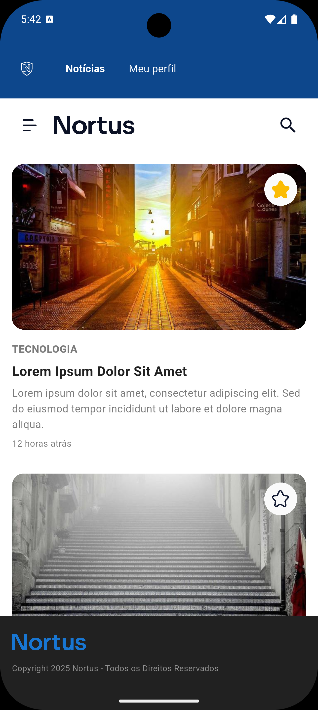
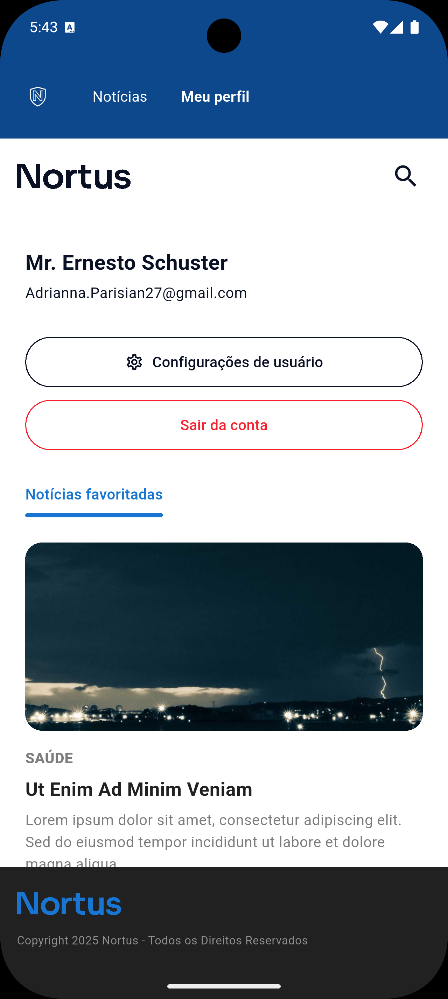

# Nortus

Aplicativo de notícias para o desafio técnico da Loomi.

---

## Overview

O Nortus é um aplicativo de notícias desenvolvido como parte do Desafio Flutter da Loomi.

O projeto tem como objetovo: implementar as funcionalidades solicitadas, demonstrar organização arquitetural, autonomia e domínio técnico. A aplicação foi estruturada seguindo princípios de Clean Architecture e boas práticas utilizadas em ambientes de produção reais.

O projeto prioriza:

- Estrutura modular por feature
- Design fiel ao mockup
- Separação clara de responsabilidades  
- Injeção de dependência  
- Abstração de HTTP  
- Gerenciamento adequado de ciclo de vida  
- Testes unitários em áreas críticas  
- Fluxo de Git organizado

---

## Screenshots

As imagens estão disponíveis em `docs/screenshots/`.

<p align="center">
  
  
</p>

<p align="center">
  
  
</p>

<p align="center">
  
</p>

---

## Tech Stack

- Flutter: 3.29.2
- Dart: 3.7.2
- Dio 
- GetIt (Injeção de Dependência)  
- BLoC (Gerenciamento de Estado)  
- go_router (Navegação)  
- SharedPreferences (Persistência local)    
- mocktail (Testes unitários)    

---

## Architecture

O projeto segue uma arquitetura modular organizada por feature.

Cada feature contém:

### Data Layer

- Models
- Datasources (consumo da API)  
- Repositories (regras e fallback)  
- Serviços de cache  

### Presentation Layer

- BLoCs  
- Pages  
- Widgets  

### Core

- Abstração de HTTP  
- Tratamento de erros  
- Utilitários  
- Setup de injeção de dependência  

---

## Architectural Decisions

- Estrutura por feature para melhor escalabilidade  
- Camada de abstração HTTP para desacoplar o projeto do Dio  
- Uso do padrão Repository para centralizar regras e fallback  
- Registro de Datasources, Repositories e UseCases como factory  
- Serviços globais (SharedPreferences e HttpClient) como singleton  
- Instanciação de BLoCs na própria tela para melhor controle de lifecycle  
- Parsing defensivo para lidar com inconsistências da API mockada  

---

## Dependency Injection Strategy

Utilizando GetIt:

- Datasources → Factory  
- Repositories → Factory  
- UseCases → Factory  
- BLoCs → Factory  
- HttpClient → Singleton  
- SharedPreferences → Singleton  

Essa estratégia evita retenção desnecessária de objetos em memória e melhora o controle de ciclo de vida.

---

## State Management

Foi utilizado BLoC para garantir:

- Estados previsíveis  
- Separação clara entre UI e lógica  
- Melhor testabilidade  

Os BLoCs são instanciados dentro da própria tela utilizando `BlocProvider`, garantindo descarte automático ao sair da página.

---

## Data Resilience

O Repository implementa:

- Estratégia de fallback: API → Cache → Mock  
- Parsing defensivo  
- Tratamento de erros com feedback visual  
- Delays artificiais de 3 segundos para simular API real  

---

## Testing Strategy

Os testes unitários focam nas áreas mais críticas:

- Parsing de models  
- Lógica de fallback do repository  
- Serviços de cache (100% de cobertura)  
- Comportamentos principais de BLoC  
- Validação de delays artificiais  

---

## Git Flow

O projeto segue um fluxo organizado:

- master  
- develop  
- feature/*  
- refactor/*  
- chore/*  
- docs/*  

Cada funcionalidade foi desenvolvida em branch separada e integrada via Pull Request para `develop`.

Os commits seguem o padrão **Conventional Commits**.

---

## Backlog Management

O backlog foi organizado no Trello:

https://trello.com/b/GSJcg95v/desafio-loomi-nortus-paulo-gabriel-andrade-de-souza

A priorização seguiu:

1. Funcionalidades principais  
2. Estrutura e arquitetura  
3. Testes  
4. Documentação e identidade do app  

---

## How to Run

Clone o repositório e execute:

```bash
flutter clean
flutter pub get
flutter run
```

---

## Design Fidelity

A interface foi implementada com base no mockup fornecido:

https://www.figma.com/design/5Hfmg9GykIqfQNcp2Rip4I/Nortus

Foram considerados:

- Hierarquia visual  
- Espaçamentos  
- Tipografia  
- Responsividade  

---

## What I Would Improve With More Time

- Estratégia offline-first mais robusta  
- Camada de analytics  
- Mapeamento de erros mais granular  
- Otimização de performance em paginação extensa  
- Refinamento maior dos componentes para maior reusabilidade

